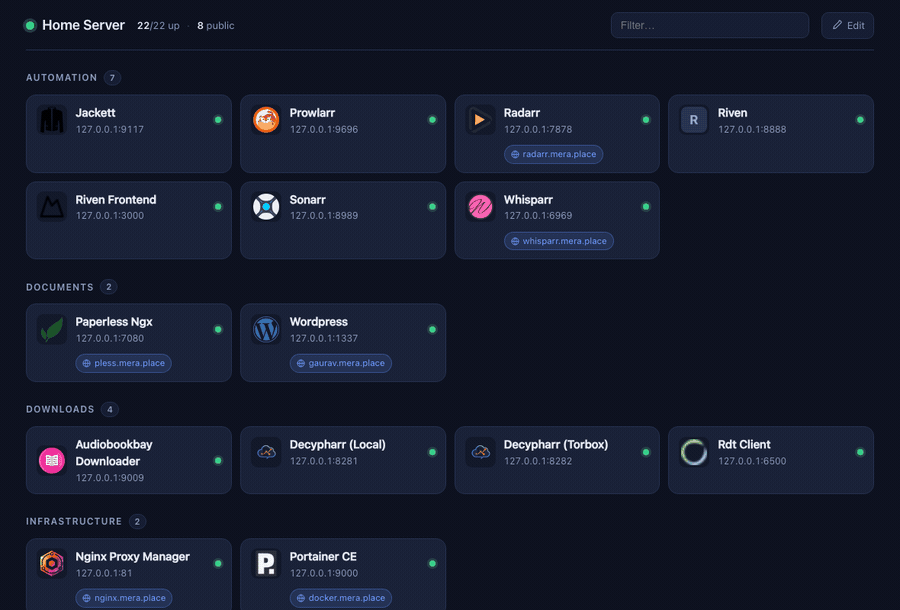
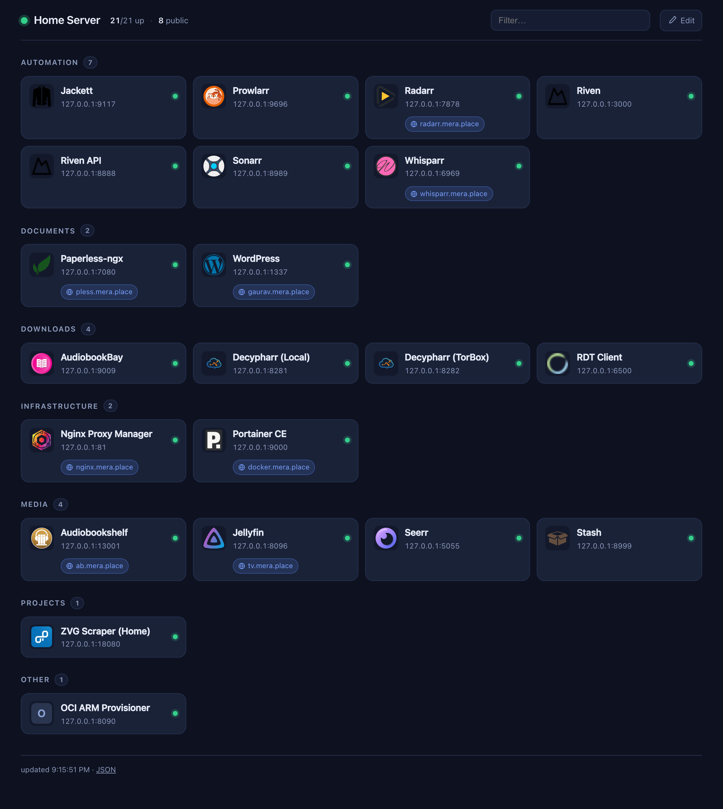
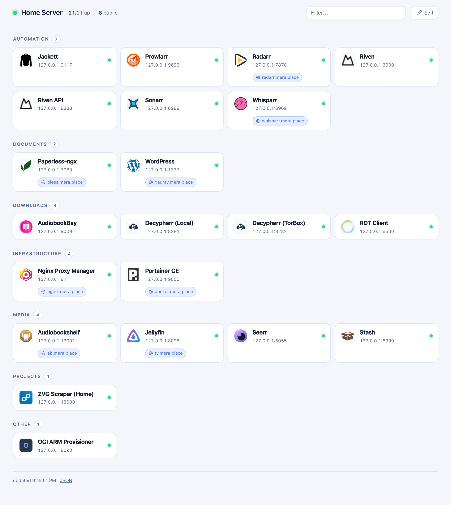
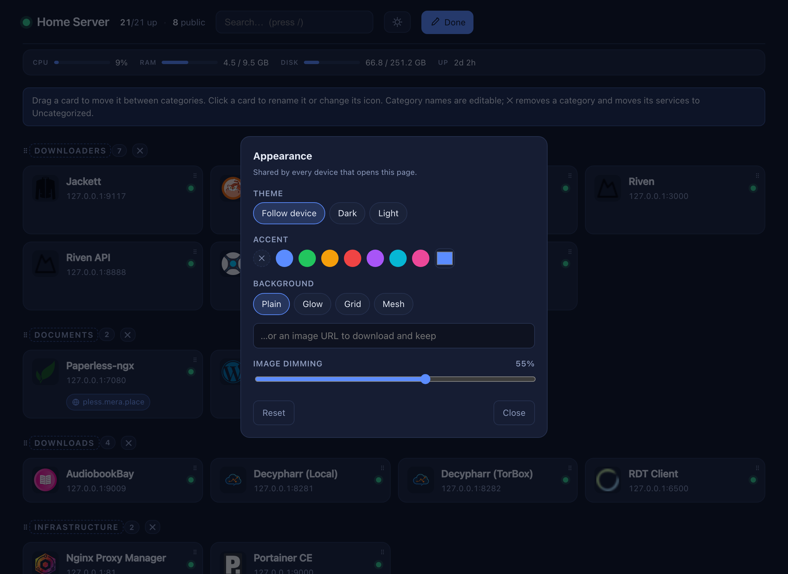
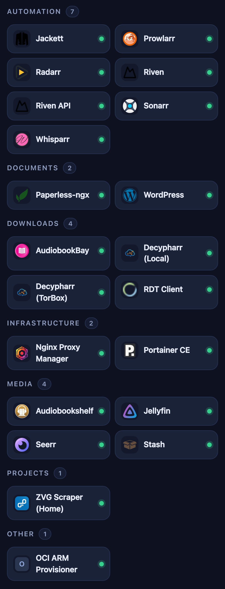

# Homelab Dashboard

[](https://github.com/gauravsuman007/Homelab-Dashboard/actions/workflows/build.yml)

**The dashboard you don't configure.** Point it at a Docker socket and you have a
page: every running service, named, iconed, grouped, with a link to each web UI
and — where the reverse proxy in front of it has a hostname pointing at that
service — a link to the public URL too.

No labels on your containers. No YAML listing your services. No bind mounts, no
host paths, no API keys. The socket is the only required input, and the compose
file below is portable as written.

Press `/` and start typing to jump to anything. The header carries the host's
CPU, memory, disk and uptime — read from `/proc` and the socket, so they need no
extra mounts either.

Where the guess is wrong, fix it on the page: rename a service, change its icon,
drag it to another category. That sticks, and everything you *didn't* touch keeps
updating itself.

> **Scope, so you can rule it out fast.** This is a launcher for a LAN or tailnet:
> links, categories, a reachability dot, host vitals, a keyboard search and
> theming. It has
> no *per-service* API widgets — no Sonarr queue depth, no qBittorrent speeds — no
> bookmarks, and no login; access control is the nginx ACL below. If you want live per-service API panels, you want
> [Homepage](https://github.com/gethomepage/homepage) or
> [Homarr](https://github.com/homarr-labs/homarr), and they are good at it. What
> those ask for in return is a `homepage.*` label on every container or a tile
> placed by hand for every service. This asks for nothing.



*Edit mode: drag a service to another category, click it to rename. Both stick;
everything else keeps deriving itself.*

```bash
docker compose up -d     # pull and start
./nginx/apply.sh         # make it the page served at the bare IP
```

Prebuilt multi-arch images are published on every push to
`ghcr.io/gauravsuman007/homelab-dashboard` for **linux/amd64,
linux/386, linux/arm/v7 and linux/arm64** — the same compose file works on a
server, a NAS, or a Raspberry Pi. Update with
`docker compose pull && docker compose up -d`. To build your own instead,
uncomment `build: .` in `docker-compose.yml` and run `up -d --build`.

## How it compares

The dashboards worth knowing about are all more featureful than this one. They
also all need to be told what you are running:

| | What it wants from you | Widgets | Host stats | Editing |
| --- | --- | --- | --- | --- |
| **This** | a socket | none | built in | in the page |

All of them theme; this one does it from the page rather than from a config file.
| [Homepage](https://github.com/gethomepage/homepage) | a `homepage.*` label per container, or YAML | ~100 service widgets | a widget | edit YAML |
| [Homarr](https://github.com/homarr-labs/homarr) | place every tile by hand | 40+ integrations | a widget | in the page |
| [Dashy](https://github.com/Lissy93/dashy) | YAML listing every service | widgets, themes | a widget | UI editor |
| [Glance](https://github.com/glanceapp/glance) | YAML | feeds, weather, markets | a widget | edit YAML |
| [Homer](https://github.com/bastienwirtz/homer) | YAML listing every service | none | none | edit YAML |

So the honest summary: if you want live API panels, use Homepage or Homarr. If
what you actually want is *the list of what is running here, correct, without
maintaining it*, that is the gap this fills. The derivation is the product; the
edit mode exists to correct it, not to build it.

## Auto-detection

| Question | Answered by | Configuration needed |
| --- | --- | --- |
| What's running, on which ports? | Docker Engine API | none |
| Which reverse proxy is in front? | container image match | none |
| Where is its routing table? | archive endpoint (NPM) or container labels (Traefik, Caddy) | none |
| Which addresses mean "this box"? | gateways + config inference + Host headers | none |
| What URL do I link to? | the Host header of each request | none |
| Which port is the web UI? | published ports, ranked; exposed ports for host-network containers | none |
| What is this service called? | OCI title label → image name → compose service | none |
| Which category? | built-in table of common self-hosted apps | none |
| Which icon? | image name → the service's own favicon → letter tile | none |
| How is the host doing? | `/proc` (not namespaced by Docker) + `docker info` | none |

The two that are worth explaining:

**The proxy's config is read through the Docker API**, not a bind mount. The edge
container is found by image, then its generated server blocks are pulled with the
same endpoint `docker cp` uses. So there is no host path to know, and it works
even when the config lives in a named volume. If your socket is behind a proxy
that filters that endpoint, set `EDGE_CONFIG_DIR` and mount the directory
instead.

**LAN URLs come from the Host header** of the request being served, so links
always point back the way you arrived — browse by LAN IP and you get LAN links,
over Tailscale you get tailnet links, by hostname you get hostname links. No
address is stored anywhere.

Knowing *which* addresses are the box is a separate problem, because a
bridge-networked container cannot read the host's interfaces. Three sources
combine:

- **docker network gateways** — host addresses by definition;
- **the proxy config itself** — an upstream IP is taken as local when **two or
  more distinct** ports at that IP are also published here. Two is what
  separates a real local address from a coincidence. On the reference box
  `192.168.2.100` matches on a dozen ports and is accepted, while a NAS at `.39`
  and an LLM host at `.123` match on at most one and are correctly rejected —
  verified, their domains are not attached to any local container;
- **addresses visitors arrive on** — filtered to private and tailnet IPs, kept in
  memory only.

`HOST_IPS` exists as an override for the one case inference can't settle: a box
publishing a *single* service, where the two-port rule can't reach certainty
before anyone loads the page.

## How discovery decides what to show

A card appears when there's something to click: a published port, an `apps.yml`
port/url, or a proxy hostname aimed at one of the container's network aliases.
Databases, sidecars and VPN containers are filtered by an image denylist in
`app/discovery.py`; naming one in `apps.yml` overrides that.

Public hostnames match a container two ways — by host address + published port
(the usual case), or by container alias + *internal* port, which is how a
container that publishes nothing can still be public (`megang.mera.place →
megabasterd-ng:5800`), and how a host-network container like Jellyfin gets its
domain.

Status dots are a **TCP connect** to the host gateway, not an HTTP request:
several services answer 401/302 at `/`, so a status-code rule would show healthy
services as down.

Icons resolve in three tiers, all served from `/icon/<slug>` and cached in
`./cache/`:

1. **[dashboard-icons][icons]** — preferred, because they're consistent, square
   and already sized for tiles.
2. **the service's own favicon** — for anything the icon set doesn't cover. The
   server fetches the app's page, reads its `<link rel="icon">` tags (preferring
   `apple-touch-icon`, the largest thing most apps ship) and falls back to
   `/favicon.ico`, which plenty of services serve without declaring it — and
   often without requiring a login. Disable with `FAVICON_FALLBACK=false`.
3. **a letter tile** — the service's initial, when neither source has anything.

Fetching happens server-side, so the browser still makes **no third-party
requests** and the page works with the LAN alone. It also means favicons resolve
for services the visitor's own browser couldn't reach.

A "nothing found" result is cached for `ICON_MISS_TTL_HOURS` (24 by default)
rather than forever, so an icon isn't lost permanently just because the service
happened to be down or still starting when it was first looked up. Delete the
`.miss` file in `cache/icons/` to retry immediately, or drop your own
`cache/icons/<slug>.png` in to override any of this.

TLS verification is off for the favicon probe: these are LAN services,
overwhelmingly self-signed, and the payload is a decorative image whose bytes are
validated as an image (by content type or magic number) and capped at 512 KB
before use.

[icons]: https://github.com/homarr-labs/dashboard-icons

## Reverse-proxy support

Three proxies are read, and which mechanism applies is decided by whichever one
is found running — there is nothing to select.

| Proxy | Where its routing table lives | How it is read |
| --- | --- | --- |
| **Nginx Proxy Manager** | generated server blocks inside the container | Docker API archive endpoint |
| **Traefik** | `traefik.http.routers.*` labels on the proxied containers | the container list, already fetched |
| **caddy-docker-proxy** | `caddy` / `caddy_N` labels on the proxied containers | the container list, already fetched |

For NPM the `set $server` / `set $port` idiom is stable across versions and
installs. For the label-driven two, the routing table arrives with the container
list, so it costs no extra API call and cannot go stale between scans — the
upstream is emitted as the container's own name and internal port, which is
exactly what the proxy dials.

What's understood, and what isn't:

- **Traefik** — `Host(...)` matchers, including several in one rule and several
  routers on one container. `PathPrefix` and other matchers are ignored (the root
  URL is still the right thing to put on a card). HTTPS is taken from `tls`,
  `tls.*` or an entrypoint named for the secure side, never assumed. The port
  comes from `loadbalancer.server.port`, falling back to the container's single
  exposed port. `traefik.enable=false` is honoured. Routers defined in a **file
  provider** rather than in labels are not seen.
- **Caddy** — site addresses on `caddy` or `caddy_0`/`caddy_1`, comma-separated
  lists, and the port from `{{upstreams N}}`. A bare domain is HTTPS (Caddy issues
  certificates automatically); only an explicit `http://` prefix is not. A
  hand-written `Caddyfile` is not parsed — only caddy-docker-proxy's labels.
- **Wildcards and regexp matchers** are skipped in both: there is no single
  address to link to.
- **Plain nginx** is not parsed. Behaviour is graceful, not broken: you get the
  full container list with links and status, just no public-URL badges.

One proxy is used per box — the first image marker matched wins. Running NPM and
Traefik side by side will surface only one of them.

To add another, extend `EDGE_KINDS` in `app/discovery.py` with an image marker
and a `source` of `"config"` (then give `parse_proxy_hosts` a branch) or
`"labels"` (then add a parser to `LABEL_PARSERS`). Either way it returns
`ProxyHost` objects and nothing downstream changes.

## Theming

A palette toggle sits in the header — it cycles **follow device → dark → light**,
and "follow device" is the default rather than a stored colour, so a new visitor
gets their own system preference instead of whatever the last person picked.

Everything else lives behind **Edit → Appearance…**:

- **Accent** — eight swatches or any colour you like. It drives links, focus
  rings, meters and the generated backgrounds, because they all read the same
  custom property.
- **Background** — `plain`, `glow` (a wash of the accent), `grid` (a blueprint
  grid), `mesh` (soft colour fields), or an image of your own. The first four are
  drawn in CSS, so they ship no assets, scale to any screen, and invert with the
  theme without a second definition.
- **Image backgrounds** are downloaded once and served from this container's own
  cache, so the page never loads from a third-party host and no URL from the form
  is ever rendered into the markup. The image always sits behind an adjustable
  scrim (default 55%) — an arbitrary photo under white text is unreadable, so the
  dimming is part of the feature rather than something to remember.

Appearance is **shared, like renames are**: one dashboard for one household, and
a look chosen on a laptop should be the look the wall tablet shows. A single
device can still pin its own palette with `?theme=dark` or `?theme=light`, which
wins over the stored value — that is also how the Home Assistant card matches its
host page.

Precedence, in full:

    ?theme=  >  stored preference  >  the device's own setting

Two notes on how this is built. The default page emits **no inline style at all**;
only values that differ from the stylesheet's own are written into a `<style>`
block. And those values are validated against a fixed set server-side before they
get there, since an accent colour that could be any string would be a stylesheet
injection.

## Search and vitals

**Search** is a keypress away: `/` or `⌘K` focuses it, `↑`/`↓` walk the results,
`Enter` opens the top one (`⌘Enter` in a new tab), `Esc` clears. Matching is by
subsequence rather than substring, so `abs` finds Audiobookshelf and `jf` finds
Jellyfin — but a literal substring always outranks a scattered match, so `radarr`
can never be beaten by something whose letters merely happen to line up. It runs
against the page you already have: no search endpoint, no round trip.

**Vitals** in the header are the host's, not the container's, and they need no
extra mounts. Docker does not namespace `/proc/stat`, `/proc/meminfo` or
`/proc/uptime`, so an ordinary unprivileged container reads the machine's real
numbers directly; CPU count and total memory come from `docker info`, which is
right even where `/proc` has been virtualised. CPU is a true utilisation figure
differenced across the refresh interval, not load average wearing a percent sign.
Meters turn amber past 75% and red past 90%, because a disk quietly filling is
the failure this strip exists to catch.

Two limits, stated rather than hidden: under **lxcfs** (Proxmox/LXC) or **Docker
Desktop** those files describe the VM or container rather than the metal; and
`Disk` is the filesystem Docker's data sits on, measured from `/` inside the
container, which on a normal install is the host's main disk. Set
`SHOW_STATS=false` to drop the strip — worth doing if the page is on a screen
guests can see. It is hidden automatically in `compact` mode, since a Home
Assistant dashboard already measures the host properly.

## The nginx snippet

`./nginx/apply.sh` detects the host's address, its LAN subnet (from the
interface's real prefix, not an assumed /24), the tailnet address, the hostname,
and the proxy container — then renders `nginx/lan-landing.conf.template` and
installs it. `--show` prints what it would do and changes nothing; `--remove`
uninstalls.

It's idempotent and safe: it backs up the proxy's `custom/http.conf`, replaces
only its own `# BEGIN/END lan-landing` block, runs `nginx -t`, and restores the
backup without reloading if the test fails. Anything else in that file is
preserved byte for byte. It keeps the five most recent backups.

Why a snippet rather than the NPM GUI: NPM's proxy hosts are keyed on domain
names, and its "Default Site" setting offers only a redirect, a 404, or static
HTML — none of which can point a bare IP at a container. Why `server_name` rather
than `default_server`: an exact name match already beats the implicit default, so
NPM's fallback block keeps answering Let's Encrypt HTTP-01 challenges and junk
traffic to the public IP.

## Access and security

The page is **unauthenticated** and reveals the internal port map of the whole
server, so it must not be published. Two things keep it internal:

- No proxy host points a public domain at it.
- The nginx block matches only the box's own names, and its `location /` allows
  the detected LAN subnet, the Tailscale range (only if a tailnet exists), and
  loopback. This matters because if 80/443 are forwarded at the router, a forged
  Host header *does* reach this vhost, and the ACL is what stops it.

The docker bridge ranges are deliberately **not** allowed. NPM publishes port 80
over IPv6 through docker's userland proxy (ip6tables NAT is off by default),
which rewrites the peer address: a request to the box's routable IPv6 address
arrives at nginx as the bridge gateway, on the IPv4 socket — indistinguishable
from a container on that bridge. Allowing `172.16.0.0/12` would therefore expose
the page to the whole IPv6 internet. The cost is that `curl` from another
container gets 403; nothing needs that. (IPv4 is DNAT'd and preserves the real
source, so the LAN rule works as written.)

**Nothing here disables or degrades IPv6.** No host sysctl, no daemon config, and
no other vhost is touched — this block simply doesn't add an IPv6 listener of its
own. Container IPv6 to smart devices is unaffected.

**On the socket mount:** `:ro` protects the socket *file*, not the API — it does
not restrict which Docker API calls are possible. What limits this container is
that its code only lists, inspects, and reads archives; it never starts, stops or
execs anything. Anyone who can reach a docker socket effectively has root on the
host, which is the usual reason to keep this page internal.

Verified behaviour on the reference box:

| From | Result |
| --- | --- |
| LAN IPv4 | 200, landing page |
| Tailscale address | 200, landing page |
| Hostname resolving to IPv4 | 200, landing page |
| Hostname resolving to IPv6 | 403 — see below |
| Public IPv6 + forged `Host` | 403 |
| Another container on a docker bridge | 403 |
| Existing proxied domains | unchanged |
| Unknown hostname | unchanged, proxy's default site |

Note on the hostname: on the reference box `debian-parallels` resolves to IPv6
addresses only, so browsing it by name takes the IPv6 path and gets 403 like any
other IPv6 request. Browse the v4 address, or add an A record / `hosts` entry if
you want the name to work.

## Configuration

All optional, set in `docker-compose.yml`:

| Variable | Default | Purpose |
| --- | --- | --- |
| `SITE_TITLE` | `Home Server` | page heading |
| `REFRESH_SECONDS` | `30` | discovery + probe interval |
| `PROBE_TIMEOUT` | `2` | seconds per TCP reachability probe |
| `INCLUDE_STOPPED` | `false` | also list stopped containers, greyed out |
| `HOST_IPS` | inferred | override for "which addresses are this box" |
| `EDGE_CONFIG_DIR` | unset | read proxy config from a mount instead of the API |
| `FAVICON_FALLBACK` | `true` | ask services for their own favicon when the icon set misses |
| `ALLOW_EDIT` | `true` | enable edit mode and the endpoints that write to it |
| `SHOW_STATS` | `true` | host CPU/RAM/disk/uptime strip in the header |
| `CUSTOMISATIONS_PATH` | `/config/customisations.json` | where edit-mode changes are stored |
| `ICON_MISS_TTL_HOURS` | `24` | how long a "no icon found" result is remembered |

`apply.sh` honours `HOST_IP`, `APP_PORT`, `NPM_CONTAINER`, `EXTRA_ALLOW`.

## Editing from the page

The pencil in the header turns on edit mode. Nothing is a separate screen — the
same grid becomes editable in place.

- **Rename a service** — click a card for a small editor. The name sticks to the
  container permanently, surviving restarts, recreates and image updates.
- **Change its icon** — a [dashboard-icons][icons] name, or paste an image URL.
  A URL is downloaded once, stored under a content-addressed name and served
  from disk, so the page never asks a browser to fetch from a third party.
- **Reorganise** — drag a card into another category, by its grip on touch
  devices or from anywhere on the card with a mouse.
- **Reorder categories** — drag a category by the grip beside its name.
  Uncategorized stays pinned last and has no grip.
- **Categories** — `+ Add category` creates one, the name is editable in place,
  and `✕` deletes it. Deleting moves its services to **Uncategorized**, which
  cannot be deleted or renamed, and has no delete button to click.
- **Reset to automatic** — drops the override and returns the card to its
  derived name, icon and category.

Renaming or deleting a category also moves services that were only there by
*derivation*, not just ones filed by hand: each gets an explicit assignment, so
nothing springs back to its derived category on the next scan.

Everything is written server-side before the UI accepts it, and the response
carries the saved values back — a failed edit is reverted on screen with the
reason, so the page never shows state the server did not store. Polling and
auto-reload pause while editing so a scan cannot move something mid-drag.

Changes live in `config/customisations.json`, next to `apps.yml` but written by
the app: JSON because round-tripping YAML would destroy the comments that make
`apps.yml` worth hand-editing. Writes are atomic, and the file is left
world-readable so you can inspect or version it. Precedence is:

    UI customisation  >  apps.yml  >  value derived from the Docker daemon

**This is why `./config` is now mounted read-write.** `apps.yml` is still only
ever read. Mount `./config:/config:ro` to forbid UI edits at the filesystem
level, or set `ALLOW_EDIT=false` to remove the edit button and reject the write
endpoints — worth considering, since the page is unauthenticated and anyone who
can open it can also rearrange it.

## Home Assistant

The leanest integration is an **iframe card pointing at this page** — no custom
component, no JS resource, no second copy of the data. Because the card *is* the
page, renames, icons, categories and reordering mirror instantly with nothing to
sync.

The page takes query parameters so an embedded view looks native rather than
like a website in a box:

| Parameter | Effect |
| --- | --- |
| `embed=1` | drops the header, hint and footer; tightens padding |
| `compact=1` | denser tiles: no address line, no public-link chips |
| `theme=dark` / `theme=light` | pin the palette (default: follow the OS) |
| `category=Media,Downloads` | show only these categories |
| `edit=1` | keep the edit button in an embedded view (off by default) |

**As a dashboard card:**

```yaml
type: iframe
url: http://192.168.2.100/?embed=1&compact=1
aspect_ratio: 75%
```

**As a full-page sidebar entry** — Settings → Dashboards → Add dashboard →
Webpage, or in `configuration.yaml`:

```yaml
panel_iframe:
  homelab:
    title: Homelab
    icon: mdi:server-network
    url: http://192.168.2.100/
```

The sidebar version keeps edit mode, so that's the one to use for rearranging.

### Three things that decide whether this works

1. **Mixed content.** An `http://` iframe inside an HTTPS Home Assistant is
   blocked by the browser. If you reach HA over plain HTTP on the LAN — the
   usual case, and the case here, since HA runs on this same box on port 8123 —
   there is no problem. If HA is HTTPS, either give this page a TLS hostname
   through your proxy or use the sidebar link instead of an embedded card.
2. **The iframe loads from your browser, not from HA.** So the *viewing device*
   must be allowed by the nginx ACL: on the LAN or the tailnet. Viewing HA
   remotely through Nabu Casa will show an empty card unless the device is also
   on the tailnet.
3. **Theme.** Left alone the page follows the device's light/dark setting, which
   usually matches HA. Pin it with `theme=` if you use a fixed HA theme.

### If you want a native card instead

A custom Lovelace card fetching `/api/apps` would inherit HA's theme exactly and
avoid iframes altogether, at the cost of a JS resource to install, CORS headers
to add here, and a second renderer to keep in step with this one. The API is
public and stable if you want to build it — `/api/apps` returns every card with
its name, icon, category, status and URLs — but it is emphatically not the lean
option, and it is not included here.

## config/apps.yml is optional

Delete it and the page still works. Nothing has to be listed for it to appear:
names, icons, categories and ports are all derived from the daemon.

- **Name** — the image's `org.opencontainers.image.title` label, else the image
  name, else the compose service name, else the container name. Titles that are
  really pull references (`hotio/whisparr:v3`) are rejected, existing
  capitalisation is preserved (`qBittorrent`), and duplicates disambiguate
  themselves: two containers of one image become `Decypharr (Local)` and
  `Decypharr (Torbox)` from their container names.
- **Category** — a built-in table of the common self-hosted apps
  (`CATEGORY_RULES` in `app/discovery.py`), not per-user config. Unmatched
  services land in "Other".
- **Port** — the published port, ranked to prefer one the reverse proxy already
  fronts. A **host-network container** uses the port its image declares as
  exposed, which is how Jellyfin's 8096 is found with nothing written down. The
  reverse proxy itself links to its admin port rather than the port it proxies
  for everything else.
- **Icon** — image name → dashboard-icons, then the service's own favicon.
- **This container hides itself** — no `hide:` entry needed.

Measured on a 22-service box, the fully automatic result matched the hand-written
one on every port and every category but one, and 21 of 23 icons resolved to the
real product artwork. What was left was acronyms the deriver can't know
(`WordPress`, `RDT Client`) and one personal grouping. That's what the shipped
`config/apps.yml` now contains — corrections, not an inventory.

Edits are re-read on every scan, so no restart is needed.

## CI

`.github/workflows/build.yml` runs on every push. A fast `check` job compiles the
sources and exercises the pure discovery functions — NPM config parsing, the
two-port host-IP inference, and the address filter — on a runner with **no Docker
socket at all**, which is what keeps that logic testable. Only if it passes does
the `build` job produce the four-platform manifest.

Publishing goes to **GHCR** using the built-in `GITHUB_TOKEN`, so a fresh clone or
fork needs no secrets. **Docker Hub** is published too, but only when
`DOCKERHUB_USERNAME` and `DOCKERHUB_TOKEN` are set — without them the run stays
green and notes that it published to GHCR only. Pull requests build all four
platforms and publish nothing.

Only amd64 builds natively; the other three go through QEMU. That is why the
Dockerfile is two-stage: PyYAML has no wheel for 386 or arm/v7, so it compiles
from source in a builder stage that carries gcc, and the runtime image copies only
the finished virtualenv.

## Screenshots

| Dark (default) | Light |
| --- | --- |
| [](docs/screenshot.png) | [](docs/light.png) |

Theme, accent and background live behind **Edit → Appearance…**:



The palette follows the device unless `?theme=` pins it. Embedded and compact,
at phone width — this is what the Home Assistant card renders:



## Files

```
.github/workflows/build.yml     checks, then the 4-platform image build
docker-compose.yml              service definition (portable as written)
Dockerfile                      python:3.12-slim + flask/gunicorn/docker/pyyaml
config/apps.yml                 hand-written overrides (live-reloaded, optional)
config/customisations.json      written by edit mode (created on first edit)
cache/                          downloaded icons (created on first run)
app/server.py                   HTTP surface, refresh loop, icon cache
app/discovery.py                docker + proxy parsing, host-IP inference
app/store.py                    customisation store: atomic writes, category rules
app/stats.py                    host vitals from /proc + docker info, no mounts
app/templates/index.html
app/static/{style.css,app.js,favicon.svg}
nginx/lan-landing.conf.template source for the server block
nginx/apply.sh                  detects, renders, installs, nginx -t, rollback
nginx/lan-landing.generated.conf  last rendered output (generated)
```
